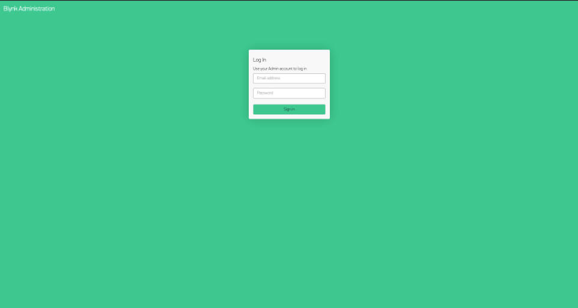
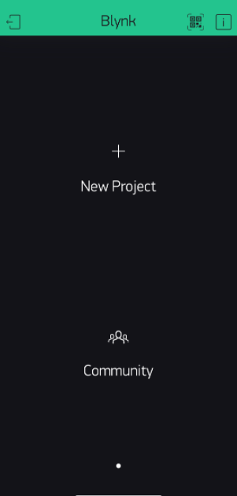

# การติดตั้ง Blynk Server บน Raspberry Pi
ในบทความนี้จะกล่าวถึง 2 ส่วนหลักๆ ได้แก่
1. การติดตั้ง `Java OpenJDK`
2. การติดตั้งและใช้งาน `Blynk Server`

## การติดตั้ง `Java OpenJDK`
มี 2 เวอร์ชั่นให้เลือกใช้ ได้แก่ 
- เวอร์ชั่น 8 อันสามารถติดตั้งได้ด้วยคำสั่ง
```
    sudo apt update
    sudo apt install openjdk-8-jdk openjdk-8-jre
```
- เวอร์ชั่น 11 อันสามารถติดตั้งได้ด้วยคำสั่ง
```
    sudo apt update
    sudo apt install default-jdk
```

## การติดตั้งและใช้งาน `Blynk Server`
1. ดาวน์โหลดไฟล์ server จาก `github repository` ซึ่งในที่นี้จะใช้คำสั่ง wget ในการดาวน์โหลด 

    - หากใช้ `Java 8` ให้ใช้คำสั่ง
    ```        
         $ wget "https://github.com/blynkkk/blynk-server/releases/download/v0.41.14/server-0.41.14-java8.jar"
    ```

    - หากใช้ `Java 11` ให้ใช้คำสั่ง

    ```
        $ wget "https://github.com/blynkkk/blynk-server/releases/download/v0.41.14/server-0.41.14.jar"
    ```

2. สร้างโฟลเดอร์เปล่าสำหรับเก็บข้อมูล `Blynk Server `

    ```
        $ mkdir data
    ```
3. สร้างไฟล์ `server.properties` ในการเก็บ `Config` ของ `Blynk Server` 

    ```
        $ nano server.properties
    ```
    - โดยมีข้อมูลดังต่อไปนี้
    ```
        Email address : jarudat@example.com
        Password : 60030014
    ```
4. ทำการเปิดใช้งาน `Blynk Server` ด้วยคำสั่ง
    ```
        $ java -jar server-0.41.14-java8.jar -dataFolder data/ -serverConfig server.properties
    ```
    - จะปรากฎข้อความดังต่อไปนี้


5. ทดลองเข้าใช้งาน Blynk Server 
    1. ผ่านหน้าเว็บไซต์โดยไปยัง URL
        ```
             https://192.168.43.217:9443/admin
        ```
        - จะปรากฎหน้าเว็บดังรูป

        

        - เข้าสู่ระบบโดยใช้ข้อมูลดังต่อไปนี้
        ```
            Email address : jarudat@example.com
            Password : 60030014
        ```
        - โดยข้อมูลนี้เป็นข้อมูลเดียวกันกับข้อ 3. 
        แต่หากไม่ได้ดำเนินการตามข้อ 3. แล้ว 
        ระบบจะทำการสุ่ม Password ขึ้นมา อันจะแสดงผลในขั้นตอนที่ 4.

        - เมื่อเข้าสู่หน้าเว็บแล้วจะปรากฎหน้าเว็บดังต่อไปนี้

        
        
    2. Mobile Application
        1. Downdload Application `Blynk` 

        2. Login เข้าสู่ระบบ จะปรากฎหน้าต่าง Dashboard 
        